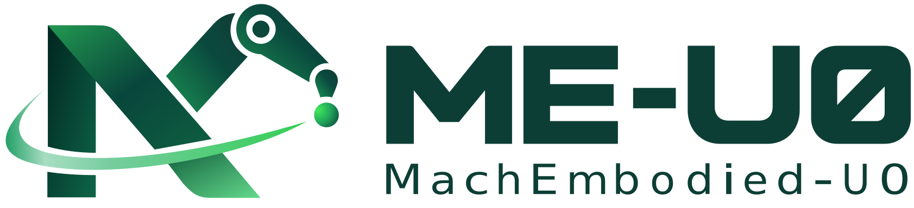
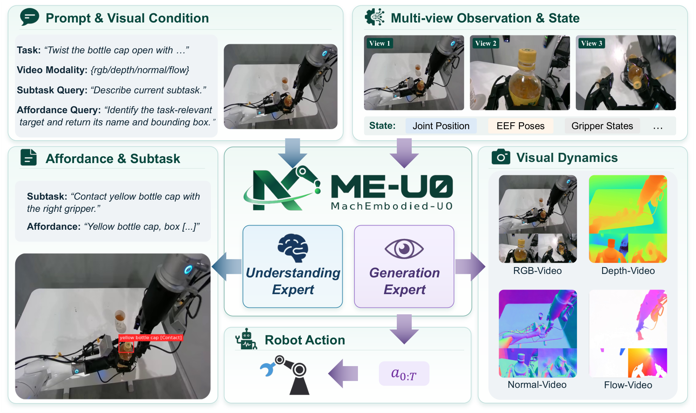
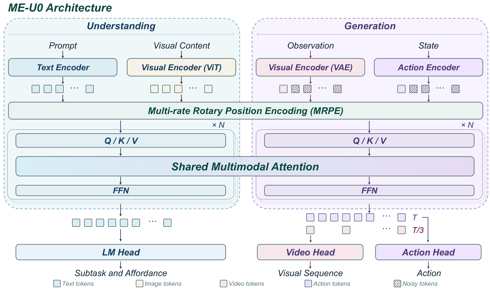

<p align="center">
  
</p>

<h1 align="center">
  
</h1>

<p align="center">
  MachEmbodied-U0: Unified Understanding and Generation Model for Embodied Intelligence
</p>

<p align="center">
  <a href="assets/ME_U0.pdf">📄 Technical Report</a> &nbsp;|&nbsp;
  <a href="https://machembodied.com/ME-U/ME-U0.html">🌐 Project Page</a>
</p>

---

ME-U0 connects task-grounded understanding with joint visual dynamics and action generation through a Mixture-of-Transformers architecture. This repository provides post-training and evaluation code for LIBERO and RoboDojo.

<p align="center">
  
</p>

## Model Architecture

The understanding expert predicts subtasks and affordances, while the generation expert jointly predicts future visual observations and robot actions. Multi-rate Rotary Position Encoding (MRPE) aligns visual dynamics with fine-grained control.

<p align="center">
  
</p>

## Getting Started

Install the dependencies in a compatible PyTorch accelerator environment:

```bash
bash scripts/install.sh
```

Prepare the Lance backbone assets (`Lance_3B_Video/`, `Qwen2.5-VL-ViT/`, and `Wan2.2_VAE.pth`) under one directory, and a compatible ME-U0 pretraining checkpoint:

```bash
export LEAP_MODEL_ROOT=/path/to/lance-assets
export ME_U0_PRETRAINED_PTH=/path/to/checkpoints/step_N
export LEAP_WORK_ROOT=/path/to/work_dirs
```

Model weights, datasets, and simulator assets are not bundled. Set the dataset paths in the corresponding YAML under `leap/configs/data/` before training.

| Recipe | Configuration | Action horizon | Video stride |
| --- | --- | ---: | ---: |
| LIBERO | [`libero_posttraining.yaml`](leap/configs/experiments/libero_posttraining.yaml) | 24 | 3 |
| RoboDojo | [`robodojo_sim_posttraining.yaml`](leap/configs/experiments/robodojo_sim_posttraining.yaml) | 48 | 2 |

LIBERO uses native delta-EEF actions and the dataset's min/max statistics. RoboDojo uses chunk-start delta-joint actions and the included H48 q01/q99 statistics.

### Post-training

```bash
bash scripts/ME_U0/run_multinode.sh 1 \
  --nproc-per-node 8 \
  --exp-name libero_posttraining \
  --work-root "$LEAP_WORK_ROOT" \
  --config leap/configs/experiments/libero_posttraining.yaml
```

For RoboDojo, select `robodojo_sim_posttraining.yaml`. On PPU clusters, use `scripts/ME_U0/train_ppu.sh`; run it with `--help` for launch options.

### Evaluation

Prepare the corresponding simulator environment and assets before evaluation. Evaluation entry points:

- LIBERO: `scripts/ME_U0/eval_libero.sh`
- LIBERO-Plus: `scripts/ME_U0/eval_libero_plus.sh` or `eval_libero_plus_distributed.sh`
- RoboDojo: `scripts/ME_U0/eval_robodojo_distributed.sh`

Pass the matching `--config` and `--checkpoint`; use `--help` for GPU selection, task suites, and output paths.
